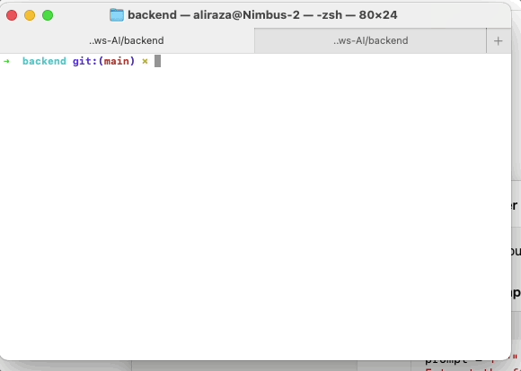

# 100 Days of AI

My 100 days of AI journey. Where I will be working on various AI projects and learning new things.

## Requirements
- Python 3.12
- Node.js v20

### Day 1: Is it Pizza?
A Vision Angular App with GPT-4o that detects whether the uploaded image is a pizza 🍕 or not.

### Day 2: Hacker News AI API
An Express API that uses Google Gemini to Summarize a Hacker news item.

### Day 11: PDF Chatbot - Sleek Doc
A nuxt.js app that lets you talk to any PDF file you upload.

